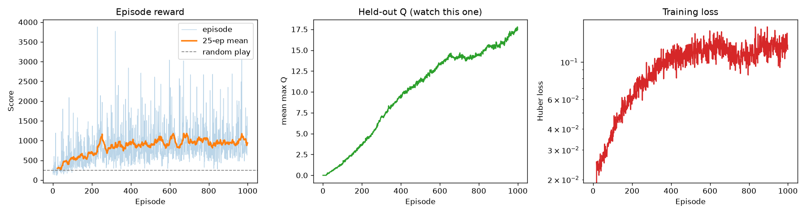

# Deep Q-Learning on Ms. Pac-Man

A DQN agent for `ALE/MsPacman-v5`, implemented in PyTorch with Gymnasium roughly based on the project outlined in [`docs/project_specs.pdf`](docs/project_specs.pdf). 

After 1,000 episodes (~750k environment steps) the agent reaches a 25-episode
mean score of roughly **1,000**, against **~250** for random play.



## Setup

```bash
python -m venv .venv && source .venv/bin/activate
pip install -r requirements.txt
```

ROMs ship with `ale-py` — no `AutoROM`, no manual ROM download.

## Usage

from notebook:

```python
from pacman_dqn import Pacman, plot_progress

agent = Pacman()
base, base_std, _ = agent.evaluate(n_episodes=10, epsilon=1.0) #random baseline
agent.train(num_episodes=2000)
mean, std, _ = agent.evaluate(n_episodes=30)    
#trained policy
plot_progress(agent)
agent.record()                                                   # -> videos/*.mp4
```

## Watching a trained agent

```python
from IPython.display import Video

agent.load('pacman_dqn.pt')
agent.record(folder='videos')
Video('videos/mspacman-episode-0.mp4', embed=True)
```

## Method

| | |
|---|---|
| Observation | 84×84 grayscale, 4-frame stack |
| Network | 3 conv layers (32@8×8s4, 64@4×4s2, 64@3×3s1) → FC 512 → 9 actions |
| Replay buffer | 50,000 transitions, stored as `uint8` |
| Optimiser | Adam, lr 1e-4, Huber loss, gradient norm clipped at 10 |
| Discount | γ = 0.99, rewards clipped to {−1, 0, +1} |
| Exploration | ε linear 1.0 → 0.05 over 100k steps |
| Schedule | 10k-step warm-up, gradient step every 4th step, target sync every 2,500 |

## Results 

Can be found in [results](results/results.md).