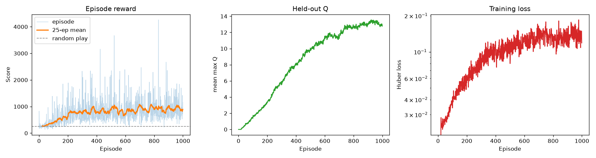

# Results

## Setup

1,000 training episodes on `ALE/MsPacman-v5`, approximately 750,000 environment steps.
Full hyperparameters in the README.

## Learning curve

| | Start | End |
|---|---|---|
| Score (25-episode mean) | ~250 | ~1,100 |
| Held-out Q | 0.0 | 12.9 |
| Huber loss | 0.02 | ~0.1 |

Most of the gain arrives in the first ~300 episodes, after which the mean
plateaus near 1,000 while held-out Q keeps rising. That divergence is expected:
ε reaches its 0.05 floor early, so further policy improvement shows up in the value estimates before it shows up in the score.

## Greedy evaluation

Scored over 30 episodes at ε = 0.05, against a random baseline over 10 episodes
at ε = 1.0:

| Policy | Mean | Std |
|---|---|---|
| Random | 247 | 125 |
| Trained (1,000 ep) | 1066 | 399 |

Reported as mean ± std over episodes rather than a best score.

## Limitations

**Lower compute:** I used 750k steps, which is ~1.5% of the 50M used by Mnih et al. (2015), who
reported ~2,300 on this game. The method itself (maybe with some other architectural and functional choices) can score even higher. 